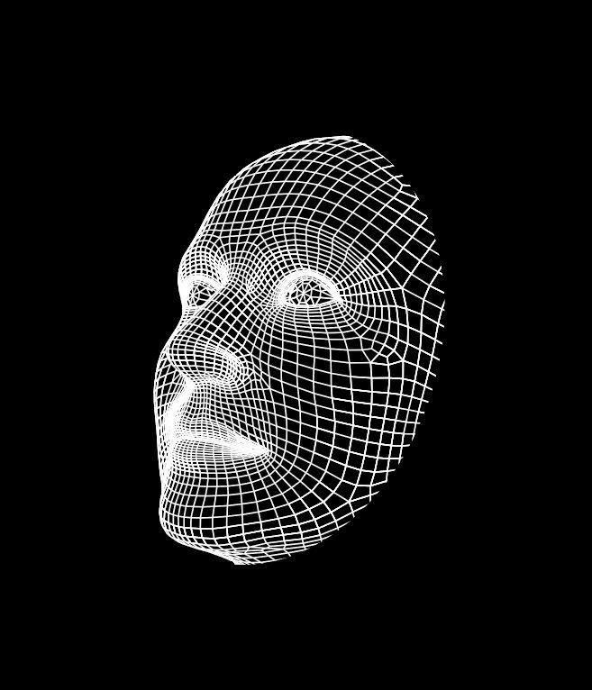

<!-- ===================== BANNER ===================== -->

  

 

<!-- ===================== APRESENTAÇÃO ===================== -->

<h1 align="center">
Oi, eu sou o Ryan
</h1>

<h3 align="center">
  Desenvolvedor Backend em formação
</h3>

---

<!-- ===================== SOBRE MIM ===================== -->

<h2 align="center">
  🚀 Sobre mim
</h2>

<table>
<tr>
<td width="55%" valign="top">
  
### Ryan, aqui 
sou estudante de Desinvolvimento de Sistemas na ETEC, focado em desenvolvimento backend.

Gosto de automatização e programar e C e C#, procuro continuar estudando sobre a área para minha compreensão sobre sistemas backend.

Atualmente, estou aprendendo C#, SQL Server, Node.js, Docker, Git, .NET MAUI/XAML, e além de fundamentos de UML/POO e gestão de projetos.

Meu objetivos são: 

> **passar em uma faculdade boa, começar a trabalhar na área e evoluir para DEV backend..**

</td>

<td width="45%" align="center" valign="middle">
  

</td>
</tr>
</table>

---

<!-- ===================== CONECTE-SE ===================== -->

<h2 align="center">
  🤝 Conecte-se comigo

---

<!-- ===================== TECH STACK ===================== -->

<h2 align="center">
  💻 Tech Stack
</h2>

<!-- ===================== OBJETIVO ===================== -->

<h2 align="center">
  🎯 Meu objetivo
</h2>

  Estou construindo minha base em desenvolvimento de software,
  com foco em backend, APIs, bancos de dados e boas práticas.

  <strong>
    Aprender → Construir → Melhorar → Repetir.
  </strong>

---

  <i>"Code. Learn. Build. Repeat."</i>

